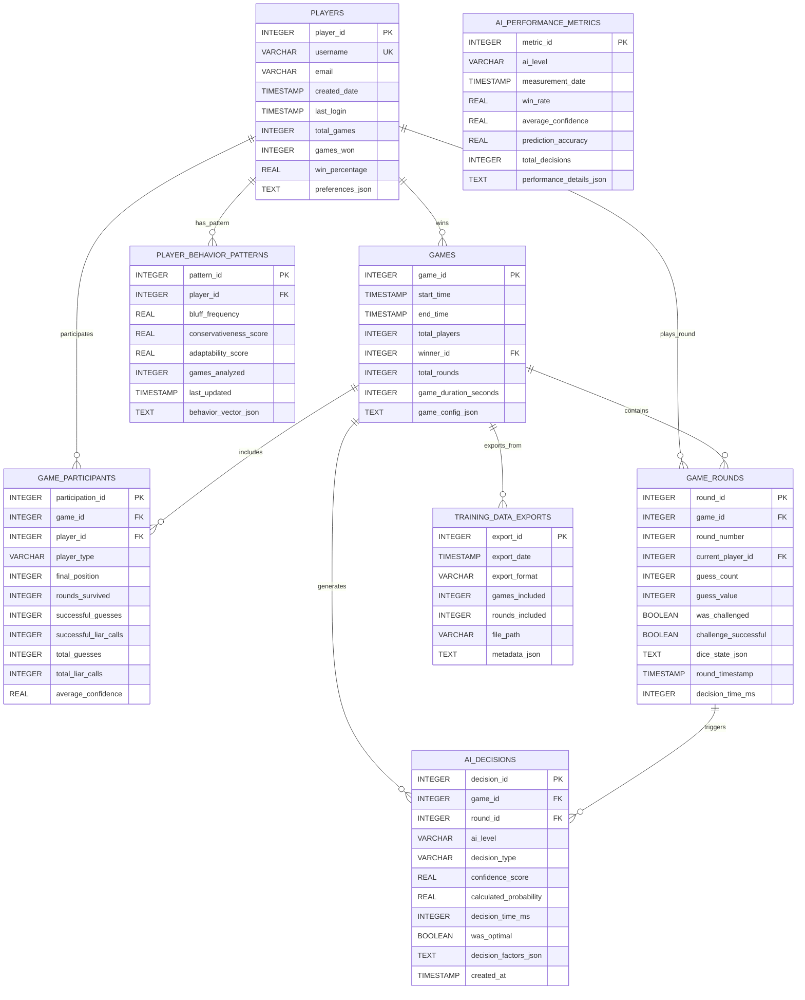

```mermaid
erDiagram
    PLAYERS {
        INTEGER player_id PK
        VARCHAR username UK
        VARCHAR email
        TIMESTAMP created_date
        TIMESTAMP last_login
        INTEGER total_games
        INTEGER games_won
        REAL win_percentage
        TEXT preferences_json
    }

    GAMES {
        INTEGER game_id PK
        TIMESTAMP start_time
        TIMESTAMP end_time
        INTEGER total_players
        INTEGER winner_id FK
        INTEGER total_rounds
        INTEGER game_duration_seconds
        TEXT game_config_json
    }

    GAME_PARTICIPANTS {
        INTEGER participation_id PK
        INTEGER game_id FK
        INTEGER player_id FK
        VARCHAR player_type
        INTEGER final_position
        INTEGER rounds_survived
        INTEGER successful_guesses
        INTEGER successful_liar_calls
        INTEGER total_guesses
        INTEGER total_liar_calls
        REAL average_confidence
    }

    GAME_ROUNDS {
        INTEGER round_id PK
        INTEGER game_id FK
        INTEGER round_number
        INTEGER current_player_id FK
        INTEGER guess_count
        INTEGER guess_value
        BOOLEAN was_challenged
        BOOLEAN challenge_successful
        TEXT dice_state_json
        TIMESTAMP round_timestamp
        INTEGER decision_time_ms
    }

    AI_DECISIONS {
        INTEGER decision_id PK
        INTEGER game_id FK
        INTEGER round_id FK
        VARCHAR ai_level
        VARCHAR decision_type
        REAL confidence_score
        REAL calculated_probability
        INTEGER decision_time_ms
        BOOLEAN was_optimal
        TEXT decision_factors_json
        TIMESTAMP created_at
    }

    PLAYER_BEHAVIOR_PATTERNS {
        INTEGER pattern_id PK
        INTEGER player_id FK
        REAL bluff_frequency
        REAL conservativeness_score
        REAL adaptability_score
        INTEGER games_analyzed
        TIMESTAMP last_updated
        TEXT behavior_vector_json
    }

    TRAINING_DATA_EXPORTS {
        INTEGER export_id PK
        TIMESTAMP export_date
        VARCHAR export_format
        INTEGER games_included
        INTEGER rounds_included
        VARCHAR file_path
        TEXT metadata_json
    }

    AI_PERFORMANCE_METRICS {
        INTEGER metric_id PK
        VARCHAR ai_level
        TIMESTAMP measurement_date
        REAL win_rate
        REAL average_confidence
        REAL prediction_accuracy
        INTEGER total_decisions
        TEXT performance_details_json
    }

    %% Relationships
    PLAYERS ||--o{ GAMES : "wins"
    PLAYERS ||--o{ GAME_PARTICIPANTS : "participates"
    PLAYERS ||--o{ GAME_ROUNDS : "plays_round"
    PLAYERS ||--o{ PLAYER_BEHAVIOR_PATTERNS : "has_pattern"
    
    GAMES ||--o{ GAME_PARTICIPANTS : "includes"
    GAMES ||--o{ GAME_ROUNDS : "contains"
    GAMES ||--o{ AI_DECISIONS : "generates"
    
    GAME_ROUNDS ||--o{ AI_DECISIONS : "triggers"
    
    %% Indexes and Constraints
    GAMES ||--o{ TRAINING_DATA_EXPORTS : "exports_from"
```