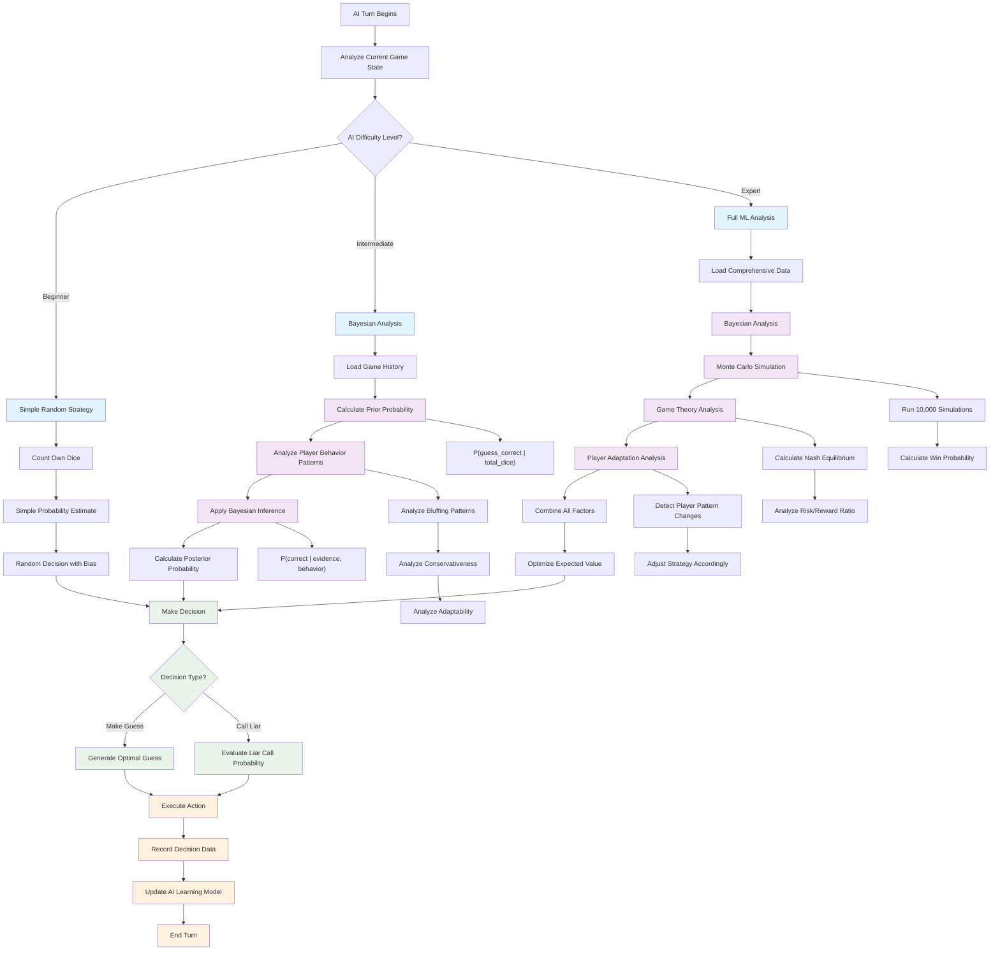

```mermaid
flowchart TD
    A[AI Turn Begins] --> B[Analyze Current Game State]
    B --> C{AI Difficulty Level?}
    
    C -->|Beginner| D[Simple Random Strategy]
    C -->|Intermediate| E[Bayesian Analysis]
    C -->|Expert| F[Full ML Analysis]
    
    D --> D1[Count Own Dice]
    D1 --> D2[Simple Probability Estimate]
    D2 --> D3[Random Decision with Bias]
    D3 --> M[Make Decision]
    
    E --> E1[Load Game History]
    E1 --> E2[Calculate Prior Probability]
    E2 --> E3[Analyze Player Behavior Patterns]
    E3 --> E4[Apply Bayesian Inference]
    E4 --> E5[Calculate Posterior Probability]
    E5 --> M
    
    F --> F1[Load Comprehensive Data]
    F1 --> F2[Bayesian Analysis]
    F2 --> F3[Monte Carlo Simulation]
    F3 --> F4[Game Theory Analysis]
    F4 --> F5[Player Adaptation Analysis]
    F5 --> F6[Combine All Factors]
    F6 --> F7[Optimize Expected Value]
    F7 --> M
    
    M --> N{Decision Type?}
    N -->|Make Guess| O[Generate Optimal Guess]
    N -->|Call Liar| P[Evaluate Liar Call Probability]
    
    O --> Q[Execute Action]
    P --> Q
    Q --> R[Record Decision Data]
    R --> S[Update AI Learning Model]
    S --> T[End Turn]
    
    %% Detailed AI Analysis Components
    E2 --> E2a["P(guess_correct | total_dice)"]
    E3 --> E3a[Analyze Bluffing Patterns]
    E3a --> E3b[Analyze Conservativeness]
    E3b --> E3c[Analyze Adaptability]
    E4 --> E4a["P(correct | evidence, behavior)"]
    
    F3 --> F3a[Run 10,000 Simulations]
    F3a --> F3b[Calculate Win Probability]
    F4 --> F4a[Calculate Nash Equilibrium]
    F4a --> F4b[Analyze Risk/Reward Ratio]
    F5 --> F5a[Detect Player Pattern Changes]
    F5a --> F5b[Adjust Strategy Accordingly]
    
    %% Styling
    classDef aiLevel fill:#e1f5fe
    classDef analysis fill:#f3e5f5
    classDef decision fill:#e8f5e8
    classDef action fill:#fff3e0
    
    class D,E,F aiLevel
    class E2,E3,E4,F2,F3,F4,F5 analysis
    class M,N,O,P decision
    class Q,R,S,T action
```