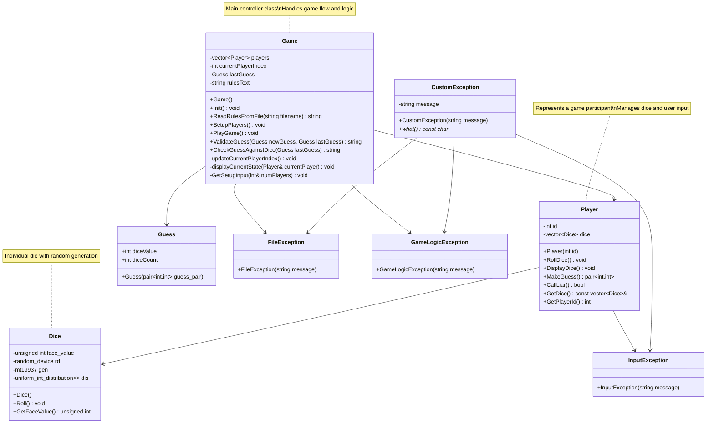

# Liar's Dice Game UML Class Diagram

```mermaid
classDiagram
    class Game {
        -vector~Player~ players
        -int currentPlayerIndex
        -Guess lastGuess
        -string rulesText
        +Game()
        +Init() void
        +ReadRulesFromFile(string filename) string
        +SetupPlayers() void
        +PlayGame() void
        +ValidateGuess(Guess newGuess, Guess lastGuess) string
        +CheckGuessAgainstDice(Guess lastGuess) string
        -updateCurrentPlayerIndex() void
        -displayCurrentState(Player& currentPlayer) void
        -GetSetupInput(int& numPlayers) void
    }

    class Player {
        -int id
        -vector~Dice~ dice
        +Player(int id)
        +RollDice() void
        +DisplayDice() void
        +MakeGuess() pair~int,int~
        +CallLiar() bool
        +GetDice() const vector~Dice~&
        +GetPlayerId() int
    }

    class Dice {
        -unsigned int face_value
        -random_device rd
        -mt19937 gen
        -uniform_int_distribution~~ dis
        +Dice()
        +Roll() void
        +GetFaceValue() unsigned int
    }

    class Guess {
        +int diceValue
        +int diceCount
        +Guess(pair~int,int~ guess_pair)
    }

    class CustomException {
        -string message
        +CustomException(string message)
        +what() const char*
    }

    class FileException {
        +FileException(string message)
    }

    class GameLogicException {
        +GameLogicException(string message)
    }

    class InputException {
        +InputException(string message)
    }

    Game --> Player
    Player --> Dice
    Game --> Guess
    Game --> FileException
    Game --> GameLogicException
    Player --> InputException
    CustomException --> FileException
    CustomException --> GameLogicException
    CustomException --> InputException

    note for Game "Main controller class\nHandles game flow and logic"
    note for Player "Represents a game participant\nManages dice and user input"
    note for Dice "Individual die with random generation"
``` 